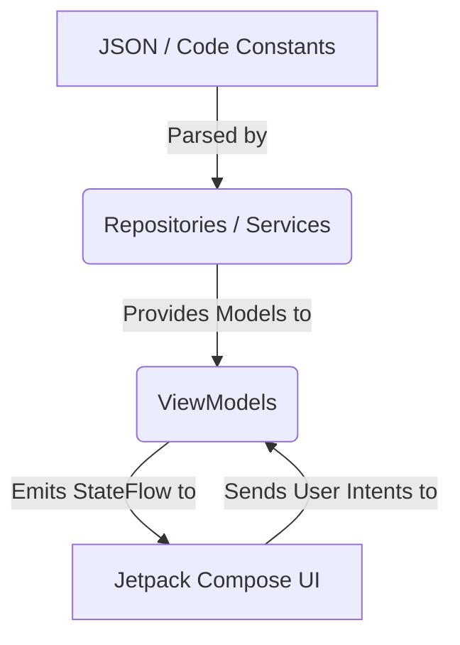

# 🏛️ Architecture Overview & MVVM Guide

Welcome! This document explains the architecture of the Athkarix Android app. Understanding this flow will help you know exactly **where** to put your code and **how** data moves through the app.

We follow the **MVVM (Model-View-ViewModel)** architecture pattern, utilizing pure Kotlin Coroutines and StateFlow.

---

## 1. The Big Picture: Data Flow

Data flows strictly in one direction (Unidirectional Data Flow):



1. **The Data Layer:** Reads static JSON data from the `assets/` folder and Kotlin constants, turning them into `data class` objects.
2. **The ViewModel Layer:** Holds the data, handles the business logic (like counting tasbeehs, moving to next page), and exposes the state.
3. **The UI Layer:** Only knows how to draw the screen based on the state. It has absolutely no business logic.

---

## 2. Package Map

See the full project tree in **[`00-getting-started.md`](./00-getting-started.md)** § *Project Directory Structure*. The short version: every Kotlin file lives under `app/src/main/java/com/athkarix/app/`, split into `di/`, `navigation/`, `ui/`, `viewmodel/`, `data/`, `util/`, plus the two root entry points `AthkarixApp.kt` and `MainActivity.kt`.

---

## 3. MVVM Layers Breakdown

```
┌─────────────────────────────────────────────────────────┐
│  VIEW (Composable functions)                            │
│  - Displays data from ViewModel                         │
│  - Sends user actions to ViewModel                      │
└────────────────────┬────────────────────────────────────┘
                     │ collects state (collectAsState)
                     │ sends events (onClick → ViewModel method)
                     ▼
┌─────────────────────────────────────────────────────────┐
│  VIEWMODEL                                              │
│  - Holds UI state as StateFlow                          │
│  - Exposes one-shot events as SharedFlow                │
│  - Survives configuration changes (rotation)            │
└────────────────────┬────────────────────────────────────┘
                     │ reads data
                     ▼
┌─────────────────────────────────────────────────────────┐
│  MODEL (Data Layer)                                     │
│  - Repositories, Services, Models, and Constants        │
└─────────────────────────────────────────────────────────┘
```

---

## 4. Manual Dependency Injection

Instead of using heavy frameworks like Hilt or Dagger, this project uses **Manual Dependency Injection** via a plain `object AppModule` factory. This keeps the app lightweight, fast to build, and easy to trace — the entire dependency graph is visible in one file (`di/AppModule.kt`).

The **canonical deep dive** — singleton vs. fresh-instance, why no Hilt, the `?:` caching pattern, the Flutter/GetX/Cubit comparison table, and how `NavGraph` consumes providers via `remember { AppModule.provide…() }` — lives in **[`07-navigation-and-di.md`](./07-navigation-and-di.md)**.

**Rule of thumb:** if the question is *what is DI, how is it structured, or why don't we use Hilt?* → read `07`. If the question is *where does this ViewModel come from in the navigation graph?* → also `07`.

---

## 5. Base ViewModels (Avoiding Duplication)

The app has 11 athkar categories that all behave the same way (paged list, tap counter, completion message). Rather than write the same logic 11 times, they share an **abstract base ViewModel**.

The full code walkthrough — `BaseAthkarViewModel` line-by-line, the `incrementPageController()` trace, the 11 subclasses table — lives in **[`04-viewmodel-deep-dive.md`](./04-viewmodel-deep-dive.md)** under *BaseAthkarViewModel — The Core Brain* and *The 11 Athkar ViewModels*.

---

## 6. State vs. Events (StateFlow vs SharedFlow)

The codebase uses two distinct patterns for communicating with the UI:

| | `StateFlow` | `SharedFlow` |
|---|---|---|
| **Purpose** | Continuous state (What is the font size?) | One-shot events (Show a toast!) |
| **Has current value?** | Yes (always accessible) | No (fire and forget) |
| **Compose API** | `val x by vm.state.collectAsState()` | `LaunchedEffect { flow.collect { } }` |

---

## 7. Key Architectural Decisions & Rules

1. **Single Activity** — The entire app lives in one Activity. Screens are swapped via Jetpack Navigation Compose.
2. **No Network** — All data is local. Athkar text is stored as Kotlin constants. The 99 Names come from a JSON file in `assets/`.
3. **Arabic-First** — The UI is RTL. `HorizontalPager` uses `reverseLayout = true`. All text is in Arabic.
4. **Never put logic in a `@Composable`** — Composables should only map data to pixels and pass click events up to the ViewModel.
5. **Never import `android.*` or `compose.*` in a ViewModel** — ViewModels should be pure logic. If you need Context, pass the exact data you need, or create a Service.
